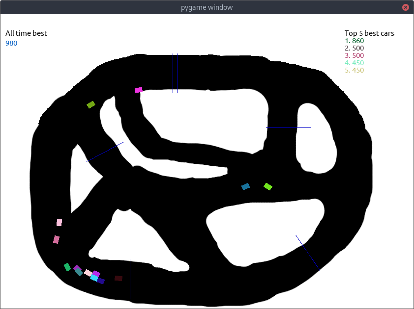

# genetic-racecars
A fast-paced intense racing game where all you do is watch colored rectangles move on the screen...

Game achieved with the help of natural selection and Python, highly advanced vector arithmetic were also used...
 
If you wish to run the game, Python must be installed along with the required libraries in `requirements.txt`.
It is also possible to edit the track by opening `track.xcf` in a paint program, and then saving it after you're done editing.

 
