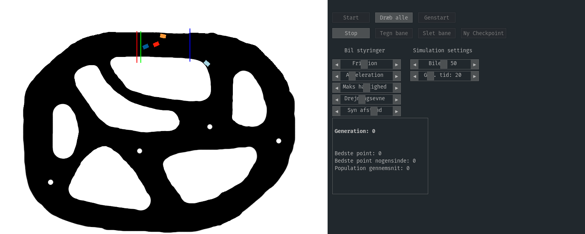

# genetic-racecars
A fast-paced intense racing game where all you do is watch colored rectangles move on the screen...

Game achieved with the help of natural selection and Python, highly advanced vector arithmetic was also used.
 
The game can be ran by cloning the repository and running `main.exe`. `main.exe` must be ran in the same directory as tracks folder, `config-feedforward` must also be present. 
The game can also be ran with Python 3.8 by running main.py, but make sure to install the dependencies in `requirements.txt` first. 

### Modifying the game
The game was made using Python 3.8.
If you wish to modify the game, then clone the repository into a project and install the required dependencies that are listed in `requirements.txt`

If you are familiar with the NEAT-Python library, you could try modifying the parameters specified in `config-feedforward` to your own liking. 
